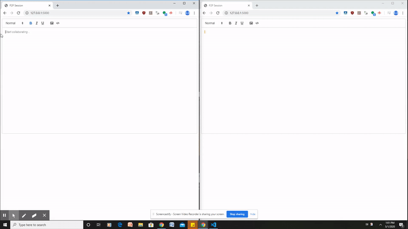

# p2p_texteditor
Collaborative text editor design on encrypted channel

## Team Members
Brian, Danny, Edwin, Yufeng, Rachid
=======

  

## Minimum Value Product
Users are able to collaborate with other people on documents and see the changes in real-time.

## User Stories
* As a user, I should be able to create documents and share the documents by sending links.
* I should be able to collaborate with other people 
* My documents should not be able to be read by unauthorized people
* As a user, I should be able to change the font and size of the text.
* My documents should be automatically saved when exited.

## Capabilities of using device:

1. Capabilities of the document interface:
   1. Each user will be able to access a cache of their changes they’ve made
   1. Able to edit and read and write the documents
   1. Saves the documents inside the website

   
 ## Software Architecture
 
 
 ## Short desription of Encryption
 Note: We are using simple encryption using symmetric keys from the same library as the hybrid encryption called [Fernet](https://cryptography.io/en/latest/fernet/)
 
  To ensure documents could not be read by the server owner or people without permission, we encrypt the files on the server.
  
  We use a hybrid cryptosystem which uses both public key cryptograpghy as well as a symmetric key. This allows the editor to be more efficient. Users on a document will each have a public and private key, while the document will be encrypted with a symmetric key. The symmetric key that encrypts the document will be shared to users that have permissions on the document, by encrypting it using their shared public key, therefore only they can decrypt it with their private key. Since the text editor is most likely to be used for file that can be large, this is more effective as most of the work is done with the efficient symmetric key decryption, while the more computational reliant public key scheme is only needed to decrypt a short key. On top of that, we use CBC (cipher block chaining) which XORs each block of plaintext with the previous ciphertext block before being encrypted, making each ciphertext dependent on its predecessor. This provides even more secrecy of data 
  
  We use fernet aes with 128bit keys for symmetric encryption, and rsa with 2048 bit keys. 
  
## Next Steps of Implementation
* Deploy the application on https host on ec2 
* Being able to choose and work on multiple documents 
* Choosing permissions for different users
* System to track users and files (permissions & keys)

## To Run locally

p2p_texteditor\editor> python .\app.py

p2p_texteditor\editor\static\node_modules\y-websocket\bin> node .\server.js
